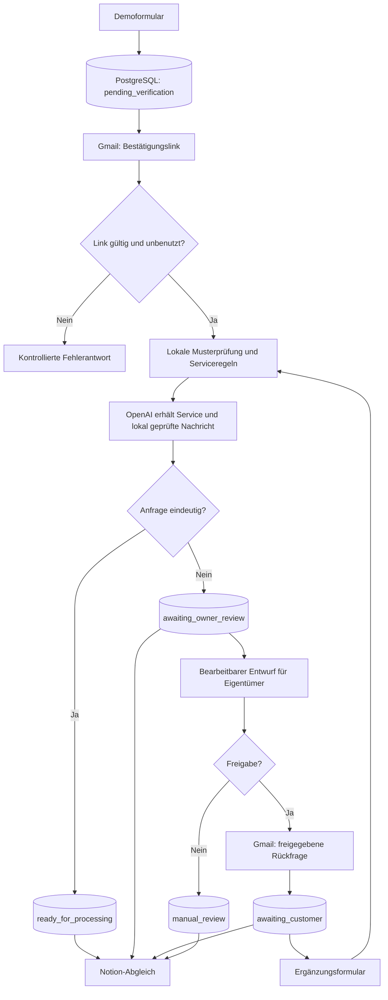

# Demo: Auftragsanfragen für Mixing und Mastering

Dieser n8n-Demoaufbau verarbeitet eine künstliche Auftragsanfrage vom Formular bis zur strukturierten Aufgabenübersicht. Er zeigt E-Mail-Bestätigung, PostgreSQL-Statusführung, datensparsame KI-Klassifikation, eine bearbeitbare Freigabe, bis zu zwei Klärungsrunden und die Aktualisierung derselben Notion-Seite.

Der Aufbau ist für ein Portfolio gedacht. Formulare, E-Mails und Beispieldaten dürfen ausschließlich mit erfundenen Angaben und eigenen Testpostfächern verwendet werden.

## Enthaltene Dateien

- [`workflow.json`](workflow.json): Hauptworkflow mit Formular, E-Mail-Bestätigung, Prüfung, Freigabe und Ergänzungsformular.
- [`notion-sync-workflow.json`](notion-sync-workflow.json): Zeitgesteuerter Abgleich neuer und geänderter Anfragen mit Notion.
- [`database/`](database/): PostgreSQL-Migrationen und zurückrollende Prüfabfragen.
- [`beispiele/demo-konfliktfall.json`](beispiele/demo-konfliktfall.json): Künstlicher Zwei-Runden-Fall mit den erwarteten Statuswechseln.

## Fachlicher Ablauf

### Datenschutzgrenze vor OpenAI

Die an den OpenAI-Node übergebene Payload enthält nur:

- den intern normalisierten Servicewert;
- die Nachricht nach der lokalen Musterprüfung, gegebenenfalls mit Platzhaltern wie `[[PII_NAME_1]]`.

Die separaten Formularfelder für Name, E-Mail-Adresse und Downloadlink sowie interne IDs, Tokens und die lokale Platzhalterzuordnung fehlen in der KI-Payload. Im Nachrichtentext ersetzt die lokale Prüfung bekannte Formularnamen und bestimmte erkennbare Kontaktmuster. Erkennt sie einen verbleibenden Kontaktwert oder eine ungeklärte Selbstbenennung, geht die Anfrage ohne KI-Aufruf in die manuelle Prüfung. Erlaubte Namensplatzhalter werden erst nach der lokalen Prüfung der KI-Ausgabe wieder eingesetzt.

Diese Musterprüfung garantiert keine vollständige Entfernung personenbezogener Angaben aus beliebigem Freitext. Ein fremder Name wie „Bitte Toni Muster kontaktieren“ oder eine Anschrift wie „Meine Adresse ist Musterstraße 5“ kann unverändert bleiben und dennoch `privacy_status: safe` erhalten. Deshalb dürfen in dieser Demo ausschließlich künstliche Nachrichtentexte verwendet werden; für echte Anfragen müsste die Datenschutzprüfung vor dem KI-Aufruf erweitert und unter realistischen Eingaben geprüft werden.

Downloadlinks werden als Text gespeichert und weder geöffnet noch heruntergeladen.

### Schutz vor Doppelverarbeitung

- Ein `submission_key` verhindert das erneute Einfügen derselben Formularausführung.
- Bestätigungs-, Eigentümer- und Ergänzungstokens werden nur als SHA-256-Hash in PostgreSQL gespeichert und atomar verbraucht.
- Ausgehende Aktionen erhalten eindeutige Schlüssel und wechseln kontrolliert von `pending` über `in_progress` zu `succeeded`.
- Ein unklarer Gmail- oder Notion-Ausgang führt zu `needs_review`; der Workflow versendet oder erstellt dann nicht automatisch erneut.
- Nach höchstens zwei angenommenen Ergänzungen endet ein weiterhin unklarer Fall in `manual_review`.

## Ohne Credentials nachvollziehen

Für die Begutachtung müssen die Workflows nicht ausgeführt werden:

1. Das Diagramm oben zeigt die fachlichen Wege.
2. Der [künstliche Konfliktfall](beispiele/demo-konfliktfall.json) dokumentiert Eingaben, Datenschutzgrenze und erwartete Statuswechsel.
3. Beide Workflow-Dateien enthalten Sticky Notes direkt am Canvas. Sie erklären die Zweige sowie die betroffenen PostgreSQL-Tabellen.
4. Die SQL-Dateien unter `database/` zeigen Schema, Berechtigungen, atomare Zustandswechsel und zurückrollende Prüffälle.

Die öffentlichen Exporte enthalten keine Credential-Zuordnungen, angehefteten Ausführungsdaten, persönlichen E-Mail-Adressen, Tokens oder API-Schlüssel. Die Platzhalteradresse `portfolio-owner@example.invalid` stoppt den Eigentümerversand absichtlich.

## Eigene lokale Demo einrichten

### Voraussetzungen

- eine lokale n8n-Instanz;
- PostgreSQL mit einer Datenbank `mixing_mastering_demo`;
- eine eingeschränkte Datenbankrolle `mixing_mastering_app`;
- eigene n8n-Credentials für PostgreSQL, Gmail und OpenAI;
- optional eine eigene Notion-Integration und Datenquelle.

Die Entwicklung und die dokumentierten Laufzeittests erfolgten auf einer lokalen, selbst gehosteten n8n-Instanz. Der gesonderte finale Importtest auf der festgelegten Zielversion `2.41.4` ist Bestandteil der noch laufenden Portfolio-Abschlussprüfung.

### PostgreSQL

Die Rolle und das Passwort werden bewusst außerhalb dieses Portfolios angelegt. Danach die Migrationen als Datenbankadministrator in dieser Reihenfolge gegen `mixing_mastering_demo` ausführen:

1. `database/001_init.sql`
2. `database/002_submission_key.sql`
3. `database/003_owner_review_token.sql`
4. `database/004_notion_sync_start.sql`

`001_init.sql` vergibt der bereits vorhandenen Rolle `mixing_mastering_app` nur `SELECT`, `INSERT` und `UPDATE` auf die benötigten Tabellen.

### Hauptworkflow

1. `workflow.json` in n8n importieren.
2. Den PostgreSQL-, Gmail- und OpenAI-Nodes die eigenen Credentials zuweisen.
3. Im Node **Eigentümeradresse konfigurieren** eine eigene Testadresse eintragen.
4. Den Workflow auf der lokalen Instanz veröffentlichen und ausschließlich künstliche Daten absenden.

Die Links in den E-Mails und die HTML-Formulare verweisen auf `http://localhost:5678/webhook/...`. Diese Produktions-Webhooks sind erst nach dem Veröffentlichen des Workflows erreichbar. Die Links funktionieren nur auf dem Rechner, auf dem n8n unter dieser Adresse erreichbar ist. Für eine andere Basisadresse müssen alle fünf fest eingetragenen Link- und Formularziele angepasst werden. Ein Test ausschließlich im Editor-Testmodus erfordert entsprechend `webhook-test/...` an diesen Stellen.

### Notion-Abgleich

Die eigene Notion-Datenquelle benötigt folgende Eigenschaften:

| Eigenschaft | Typ |
| --- | --- |
| Auftrag | Titel |
| Anfrage-ID | Text |
| Bearbeitungsstand | Auswahl |
| Statuscode | Text |
| Ursprünglicher Service | Auswahl |
| Bestätigter Service | Auswahl |
| Service unklar | Checkbox |
| Aktualisiert | Datum |
| Kundenname | Text |
| E-Mail | E-Mail |
| Ursprüngliche Nachricht | Text |
| Downloadlink | URL |

Nach dem Import von `notion-sync-workflow.json`:

1. PostgreSQL- und Notion-Credentials zuweisen.
2. Im Node **Notion-Seite mit Titel anlegen** die eigene Datenquelle auswählen.
3. Den Workflow aktivieren.
4. Einmal `database/enable_notion_sync_new_only.sql` ausführen.

Die Startgrenze sorgt dafür, dass nur danach angelegte Anfragen automatisch synchronisiert werden. PostgreSQL bleibt die maßgebliche Datenquelle; Notion dient als Aufgabenübersicht.

## Geprüfte Szenarien

- gültige E-Mail-Bestätigung und erneute Verwendung desselben Links;
- ungültiger Bestätigungslink;
- klare, widersprüchliche und mehrdeutige Serviceangaben;
- Sperre vor OpenAI bei von der lokalen Musterprüfung erkannten, nicht bereinigten Kontaktangaben;
- bearbeitete Eigentümerfreigabe mit erfolgreichem Kundenversand;
- Ablehnung ohne Kundenversand;
- zwei aufeinanderfolgende Ergänzungsrunden desselben Vorgangs bis `ready_for_processing`;
- Notion-Erstellung und Aktualisierung derselben Seite sowie getrennte Fehlerverbuchung.

## Grenzen

- Die lokale Musterprüfung erkennt keine beliebigen Namen oder Anschriften im Freitext. Die Demo ist deshalb auf künstliche Angaben beschränkt; `privacy_status: safe` ist keine allgemeine Datenschutzfreigabe.
- Für Fehler des OpenAI-Nodes gibt es im Export noch keinen fachlichen Fehlerpfad. Bei einem Node-Fehler endet der Lauf nach dem aktuellen Ablauf voraussichtlich, während die Anfrage auf `evaluating` bleiben kann. In einer echten Umgebung muss ein Fehlerpfad ergänzt werden, der den Fall in einen definierten Prüfstatus überführt und die manuelle Wiederaufnahme regelt. Ein solcher Ausfall wurde nicht live getestet.
- Die Demo nimmt keine Dateien entgegen und öffnet keine Downloadlinks.
- Gmail bietet in diesem Aufbau keine externe Idempotenzgarantie. Ein unklarer Versand wird deshalb zur manuellen Prüfung angehalten.
- Rechnungsstellung, Auftragsannahme und Beginn der Audioarbeit bleiben manuelle Entscheidungen.
- Die Formulare besitzen keine produktive Benutzerverwaltung und sind nur für die lokale Portfolio-Demo bestimmt.
- Echte Kundendaten gehören nicht in diesen Aufbau.
